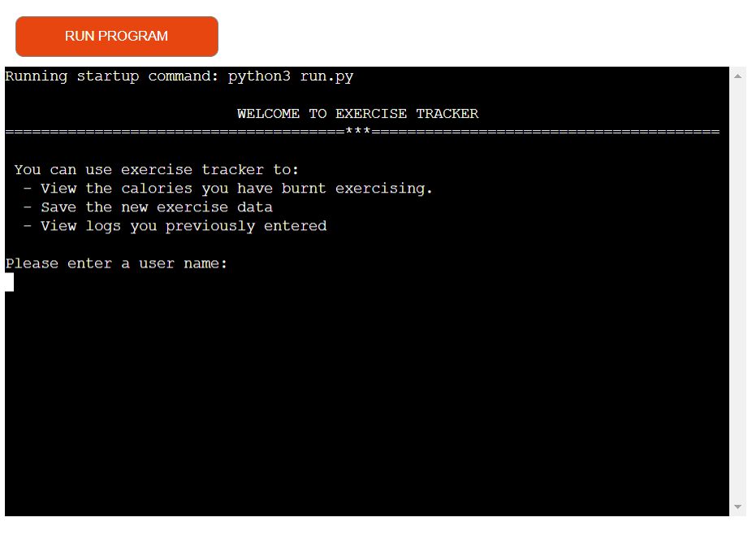
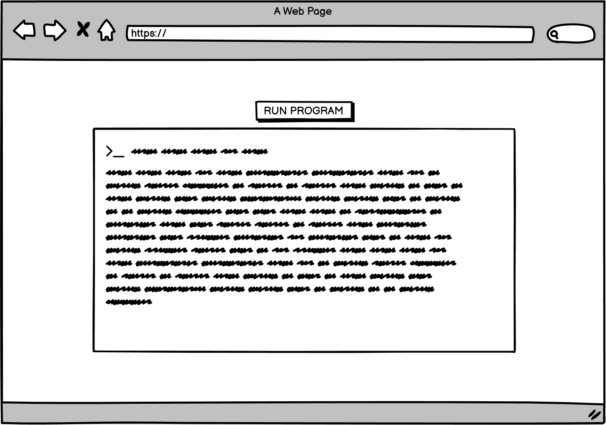
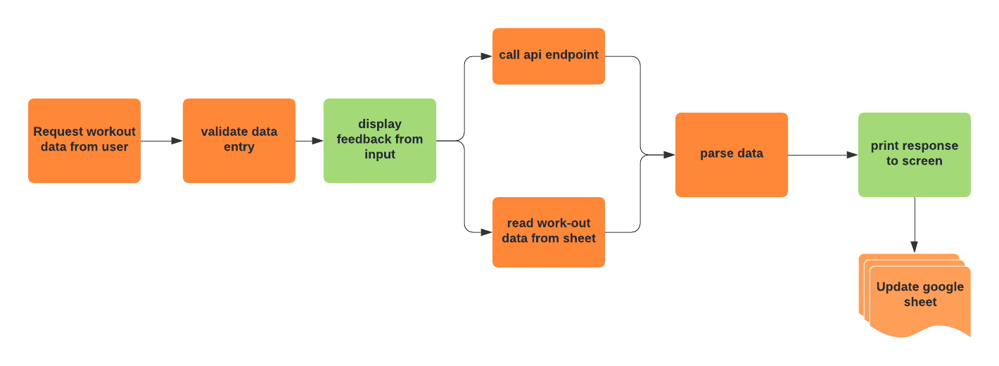
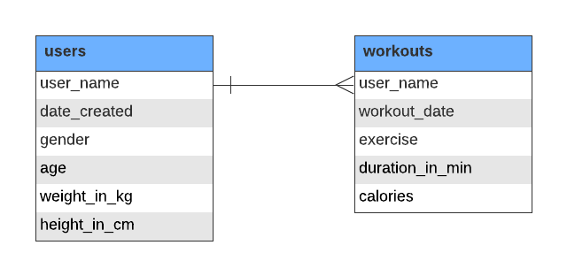
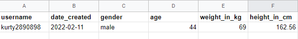
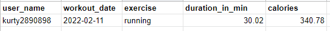
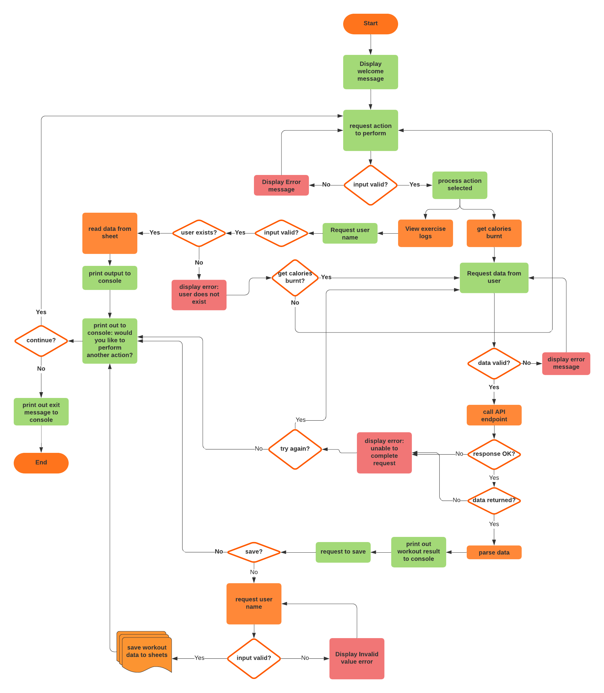
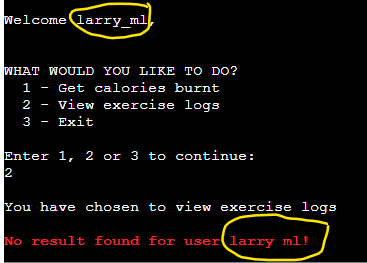

<h1 align="center">Workout Tracking</h1>

[View the live site here](https://exercise-logging.herokuapp.com/)

This project is designed towards the fulfilment of my code institute program. 
The goal of the project is to design a console based workout tracker which logs the exercises along with the amount of calories a user burns from working out.

<h2 align="center"></h2>


## Table of Content
- [User Experience](#user-experience-ux)
    - [User Stories](#user-stories)
        - [First time Visitor Goals](#first-time-visitor-goals)
        - [Returning Visitor Goals](#returning-visitor-goals)
    - [Potential Features to Include](#potential-features-to-include)
- [flowchart](#flowchart)
- [Features](#features)
- [Technologies Used](#technologies-used)
    - [Languages](#languages)
    - [Programmes Used](#programmes-used)
- [Testing](#testing)
    - [Testing User Stories](#testing-user-stories)
    - [Validation](#validation)
    - [Known Bugs](#known-bugs)
- [Deployment](#deployment)
- [Credits](#credits)
    - [Acknowledgements](#acknowledgements)

## User Experience (UX)

-   ### User Stories

    -   #### First time Visitor Goals
        As a first-time user, I would like to:

        -	know what to expect from the application
        -	know what information to provide
        -	follow instructions provided and get appropriate feedback from action performed
        -	get feedback when the information provided is incorrect
        -	view the workout data along with calories burnt from workout
        
    -   #### Returning Visitor Goals
        As a returning user, I would like to:
        -	view and select to perform an action from a list of actions 
        -	get feedback based on information provided
        -	request to view workout details by entering text like “ran 5k and danced for 30 minutes”
        -	get feedback when the data request is processing.
        -	view workout information including calories when I enter valid data
        -	see an overview of the total exercises and calories I have burnt based on the data I have saved
        -	choose to save workout information

    ### Design
    -   #### Colour Scheme
        The main colors used for this project are white, red, blue and green.
        - Red text was used to display error messages.
        - while green for attribution and success messages after successfully adding user data after the worksheet. 
        - Blue color was used to display example input
    
    ### Wireframes
    -   Home Page Wireframe
    <p align="center"></p>


## Features 
-   ### Potential Features to Include

    -	Input workout information from the terminal
    -	Given work-out request retrieve burn
    -	Save data in google sheet
    -	Display workout and calories burnt summary to user.
    

-   ### Initial Concept

    The application is a console application which takes exercise input from the user and get the calories based on the workout type and duration. google sheets API was used for storing the data provided by the user, and [nutritionix API](https://developer.nutritionix.com/) for retrieving the calorie information.


## Program Design
-   ### Program Structure
    -	Collect workout data from user
    -	Validate data entry
    -	Get calories information from API endpoint
    -	Add data to sheet
    -	Display calories burnt from workout data entered by user.
    -	Display total calories from workout grouped by workout type

    <p align="center"></p>

-   ### Data Model
    <p align="center"></p>

    Data from the user are stored in google sheets. The workbook comprises of two worksheets:
    - users - for storing the user profile
    - workouts - for storing workout stats
    <p align="center"></p>
    <p align="center"></p>
    
-   ### Program Logic

    <p align="center"></p>

## Technologies Used
- ### Languages Used
    - Python

  ### Frameworks, Libraries & Programs Used
  1. [Git](https://git-scm.com/) - for version control by utilizing the Gitpod terminal to commit to Git and Push to GitHub.
  2. [GitHub:](https://github.com/) - used to store the projects code after being pushed from Git.
  3. [Balsamiq:](https://balsamiq.com/) - to create the wireframes during the design process.
  4. [Lucid Chart](https://www.lucidchart.com/) - for design of the flowchart, data model and program structure.
  5. [Heroku](https://heroku.com/) - used to deploy application.
  6. [Nutritionix API](https://developer.nutritionix.com/) - used for the natural language search and calculating calories burnt from exercise.
  7. [Google Sheet](https://www.google.co.uk/sheets/about/) - for storing the user and exercise data
  8. [Pep8 Online Python Checker](https://www.google.co.uk/sheets/about/) - for code validation


## Testing

### Testing Code
Pep8 Online Checker was used to validate each page of the project. Errors found were fixed and the pages were tested again to ensure there were no syntax errors.


### Testing User Stories from User Experience (UX) Section

- #### First Time Visitor Goals
  1. know what to expect from the application
     - The page lists out what the user can do with the application
  2. know what information to provide
     - A selection menu is displayed and the expected input is also made known.
     - Users are given instructions and the prompt for data mentions what kind of data it is expecting for example **height in cm**.
  3. follow instructions provided and get appropriate feedback from action performed
  4. get feedback when the information provided is incorrect
     - feedback is printed out to the terminal when user performs an action and in the case of an error the output is displayed in red text.
  5. view the workout data along with calories burnt from workout
       - When a search is performed, the exercise stats which contains the calorie information is displayed in tabular format.
       
-   #### Returning Visitor Goals
    1. view workout information including calories when I enter valid data
       - When a search is performed, the exercise stats which contains the calorie information is displayed in tabular format.
    2. see an overview of the total exercises and calories I have burnt based on the data I have saved
       - The user is prompted to make a selection from a list, one of which is to view exercise records.
       - If the user makes a valid entry and has record previously saved, it is retrieved from the workouts sheet and displayed to user in a tabular format.
       - If there is no previous record for the user then a feedback message is printed out to the terminal.
    3. choose to save workout information
       - When workout stats is displayed, the user is prompted to save data.
       - if user chooses to save, then the information is saved in the google sheet
       
### Known Bugs
#### Current
- Using Microsoft Edge browser, when a user chooses to view exercise logs and no records are found, the error message printed out does not contain special characters such as '_' if present in a user name. In the image below, this is highlighted in yellow.



#### Resolved
- When prompted for exercise the user did, if no result was returned an empty array was printed out the console.
- In the initial design of the program a user was not asked for user name unless they wanted to view logs or save exercise data. This made the program less user friendly as a result the program was modified to prompt the user for a username at the start of the program.

## Deployment

### Setup API credentials and google spreadsheet
- create a new [Google sheet](https://www.google.co.uk/sheets/about/)
    - name the sheet exercise-workout.
    - The sheet should have 2 worksheets and with fields shown in [data model](#data-model)
- from Google cloud create a new project and activate your API credentials
    - from the project's dashboard, select **APIs & Services** and click on Library
    - search for Google Drive API and click on Enable button
    - from the Google Drive API click Create Credentials button and fill out the form.  
    - and get API credentials and download credentials file
- sign up for an API key on [Nutritionix API website](https://developer.nutritionix.com/)
- verify email and login. Once logged in you can view your ID and KEY


### Clone GitHub repository

1. Log in to GitHub and locate the [GitHub Repository](https://github.com/valerieoni/exercise-tracking)
2. Click the `Code` dropdown arrow button just above the list of files.
3. To clone the repository using HTTPS, under "Clone with HTTPS", copy the link.
4. Open a terminal on your computer
5. Change the current working directory to the location where you want the cloned directory to be made.
6. Type `git clone`, and then paste the URL you copied in Step 3.

```
$ git clone https://github.com/valerieoni/exercise-tracking
```

7. Press Enter. Your local clone will be created.
8. Create creds.json file in the root directory and save Google credentials in the file
9. Rename .env.example to .env and update the file with your Nutritionix API ID and KEY values


### Heroku

The project was deployed to [Heroku](https://www.heroku.com/).

#### Prerequisites:
- you forked or copied this project into your repository on GitHub.
- Heroku requires these files to deploy successfully, they are both in the root folder of the project:
  - `requirements.txt`
  - `Procfile`
- you already have a Heroku account, or you need to register one.

#### Create a Heroku App
Follow these steps to deploy the app from GitHub to Heroku:
- Sign in to  Heroku. Signup if you do not have an account.
- From the Heroku dashboard, click on **Create New App**, give it a platform-unique name
- choose region, click on **Create app** button
- Click on **settings** tab
  - click on **Reveal config vars** button
  - add a key of PORT and VALUE of 8000
  - Add the creds.json content
    - in the field for `KEY`, enter CREDS
    - copy the content of the creds.json from your project and paste the content copied into the `VALUE` field.
    - click the **Add** button
  - Add the API id and key
    - in the field for `KEY`, enter NUTRITIONIX_API_ID
    - in the `VALUE` field paste the value of NUTRITIONIX_API_ID from the env file
    - click the **Add** button
    - Repeat the above 3 steps to add NUTRITIONIX_API_KEY
  - Add Buildpack to install dependencies needed
    - select Python and click **save changes**
    - Click on Add buildpack button to add nodejs
    - ensure python is the first item on the list
- Click on the Deploy tab and select GitHub as the deployment method and click **Connect to GitHub** button
- In the GitHub authorization popup window login into GitHub with your GitHub username and click on `Authorize Heroku` button
- Type in your repo name and click `search`. It lists your repos. Choose the one and click on `connect` next to it.
- select the branch you want to deploy from the drop-down menu beneath **choose a branch to deploy**
- either enable automatic deployment on every push to the chosen branch or stick to manual deployment
- for the manual deploy, click on **Deploy branch** button and when the deployment is complete, click on **View** button to start the program

1. Log in to GitHub and locate the [GitHub Repository](https://github.com/valerieoni/project-2)
2. In the GitHub repository, navigate to the Settings tab
3. Scroll down the Settings page until you locate the **Pages** Section.
5. Click on the **Pages** tab close to the bottom of the page
4. Under **Source**, click the dropdown called `none` and select `main` Branch.
5. Click "Save" button to save the changes and this will trigger the site deploymment automatically.
6. When you refresh the page, you will see that the site has been successfully published, along with a link to the published site.

## Code
- [Stack Overflow](https://stackoverflow.com/questions/43634618/how-do-i-test-if-int-value-exists-in-python-enum-without-using-try-catch) - for checking that a value exists in  Enum
- [Stack Overflow](https://stackoverflow.com/questions/16511337/correct-way-to-try-except-using-python-requests-module) - for requests exceptions

## Credits
- The application template was provided by Code Institute.
- The search and calorie calculation is powered by [Nutritionix API](https://developer.nutritionix.com/)

### Acknowledgements
-   A big thank you to my mentor, Narender Singh, for his advice, patience, and going through the code and providing feedback on how to improve it.
-   The Slack community for their support and guidance
-   Tutor support at Code Institute for their support.