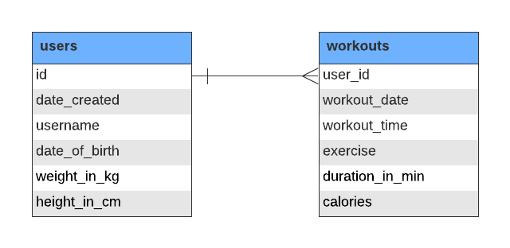

<h1 align="center">Workout Tracking</h1>

This project is designed towards the fulfilment of my code institute program. 
The goal of the project is to design a console based workout tracker which logs the exercises along with the amount of calories a user burns from working out.

<h2 align="center">[image here]</h2>

## User Experience (UX)

-   ### User stories

    -   #### First time Visitor Goals
        As a first-time user, I would like to:

        -	know what to expect from the application
        -	know what information to provide
        -	follow instructions provided and get appropriate feedback from action performed
        -	get feedback when the information provided is incorrect
        -	view the workout data along with calories burnt from workout

    -   #### Returning Visitor Goals
        As a returning user, I would like to:

        -	view and select to perform an action from a list of actions 
        -	get feedback based on information provided
        -	request to view workout details by entering text like “ran 5k and danced for 30 minutes”
        -	get feedback when the data request is processing.
        -	view workout information including calories when I enter valid data
        -	see an overview of the total exercises and calories I have burnt based on the data I have saved
        -	choose to save workout information

-   ### Potential Features to Include

    -	Input workout information from the terminal
    -	Given work-out request retrieve burn
    -	Save data in google sheet
    -	Display workout and calories burnt summary to user.

-   ### Initial Concept

    The application is a console application which takes work out input from the user and get the calories based on the workout type and duration. I anticipate using google sheets API for storing the data provided by the user, and [nutritionix API](https://developer.nutritionix.com/) for retrieving the calorie information.
  

-   ### Design
    -   #### Colour Scheme
        -   The two main colours used are Code Insititue red, and white.
    -   #### Typography
        -  font used 
    -   #### Imagery
        -   Imagery is important. The large, background hero image is designed to be striking and catch the user's attention. It also has a modern, energetic aesthetic.

-   ### Wireframes

    -   Home Page Wireframe

    

-   ### Program Structure

    -	Collect workout data from user
    -	Validate data entry
    -	Get calories information from API endpoint
    -	Add data to sheet
    -	Display calories burnt from workout data entered by user.
    -	Display total calories from workout grouped by workout type

    

-   ### Data Model

    Data from the user will be stored in google sheets. The workbook comprises of two worksheets – one for the user profile and the second for the workout.

    

    
-   ### Program Logic

    

